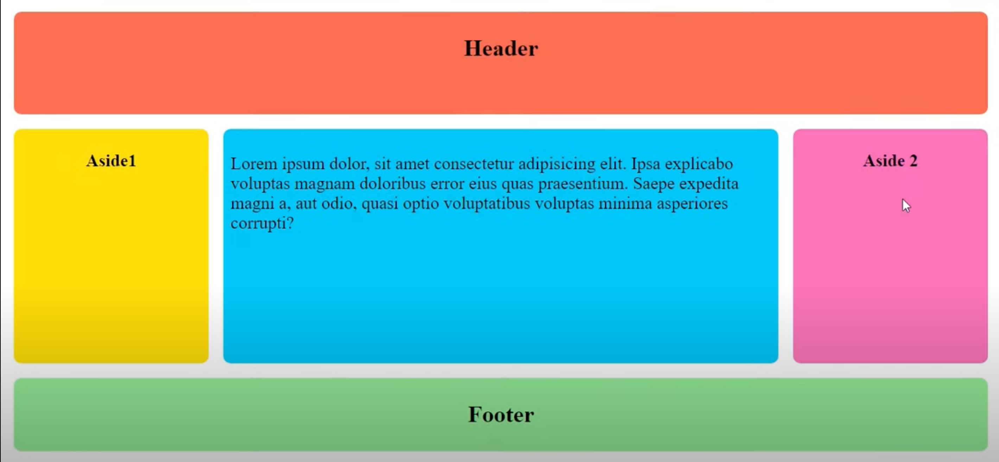
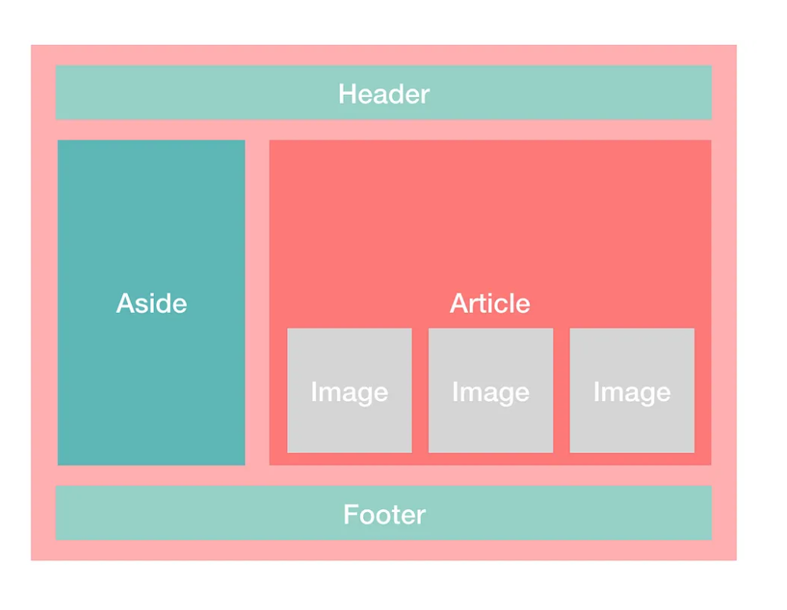
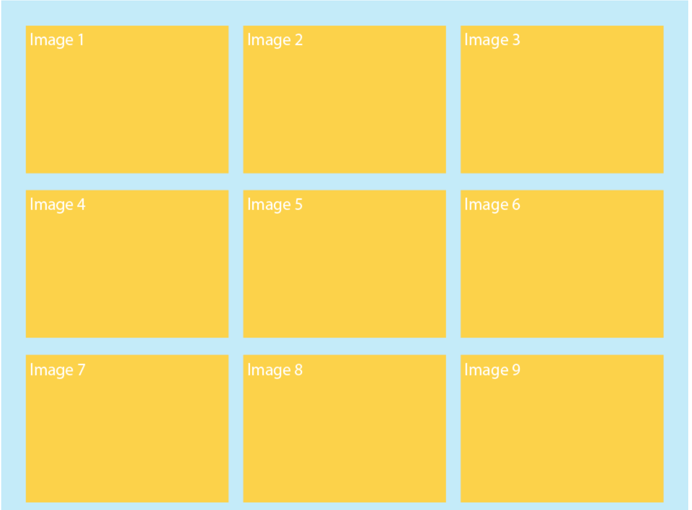
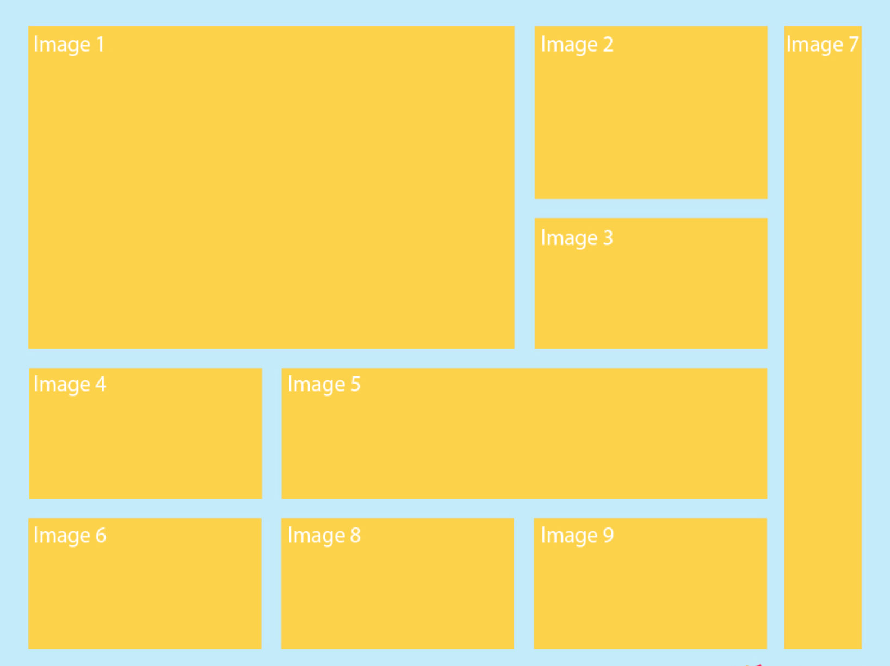
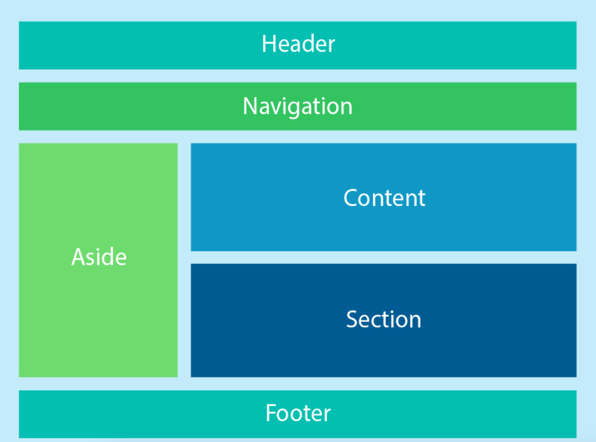

# CSS Activity 10 - CSS Flexbox & Grid

## 📋 Instructions

Using the Flexbox and CSS grid properties that we have covered, recreate the 5 layouts shown below.

If using VSCode, you can create a main folder with a recognizable name, and you can create 5 sub folders for each project. 

Make sure to save your code.

## 🖼️ Example

#1 

#2 

#3

#4 

#5

