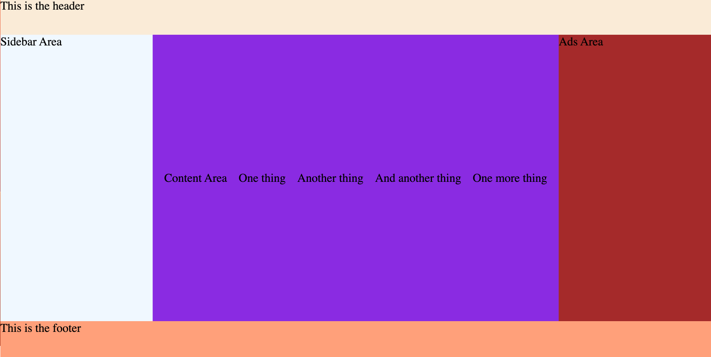

# CSS Activity 11 - Recreate the Layout

## 📋 Instructions

Recreate the image provided below using flexbox and shorthand properties.  

Things to note:  
- You do not have to include any other text besides whats been shown.
- The Content Area is 5 different areas that include text:
  
  ```
  <tag> Content Area </tag>
  <tag> One thing </tag>
  <tag> Another thing </tag>
  ...etc
  ```

- Utilize the flex item properties: `flex-grow`, `flex-shrink`, `flex-basis`
- Remember that changing the `flex-direction` changes which axis is affected vertically or horizontally.

## 🖼️ Example


