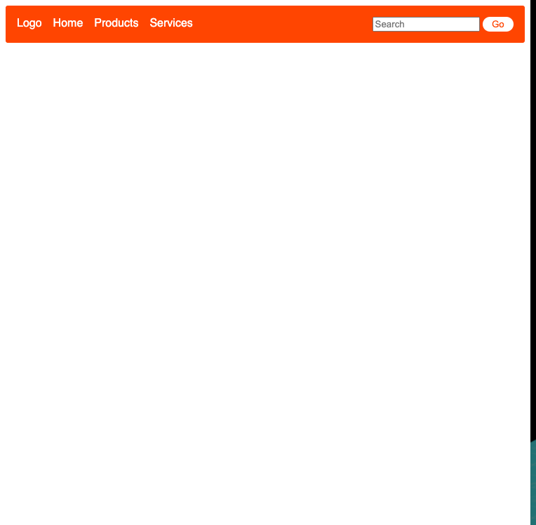
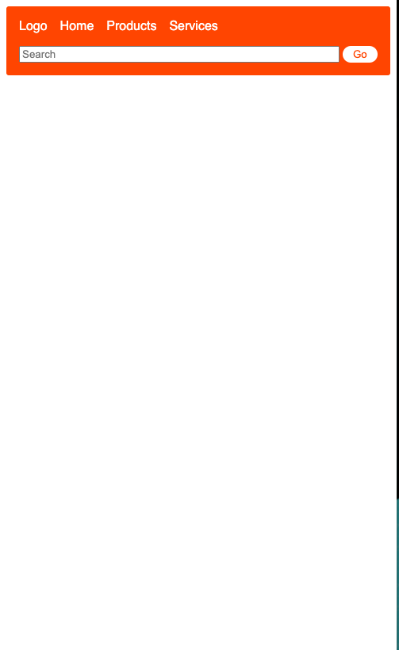

# CSS Activity 13 - CSS Form with Media Query

## 📋 Instructions

You will create a webpage with a navigational bar that includes:
- Logo
- Buttons (Home, Product, Services for example),
- Search bar
- Button for the search

Your navigation bar should be noticeably different from the rest of your website. The rest of the website can be empty. 

At full screen your webpage should resemble the image below (Navbar Full Screen).  

Secondly, create a media query so that when your website reaches a certain size, your search bar expands and wraps to a new line as demonstrated in the second image below (Navbar Small Screen).

## 🖼️ Example

Navbar Full Screen

Navbar Small Screen

