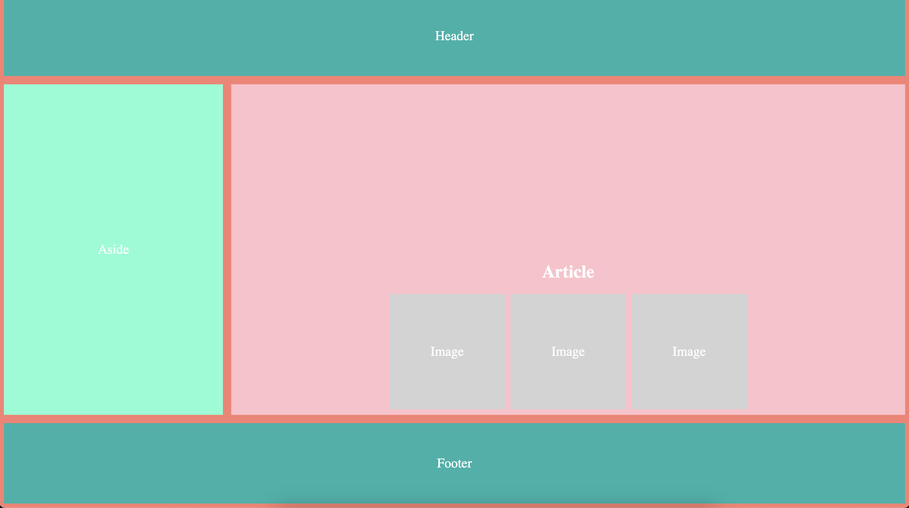
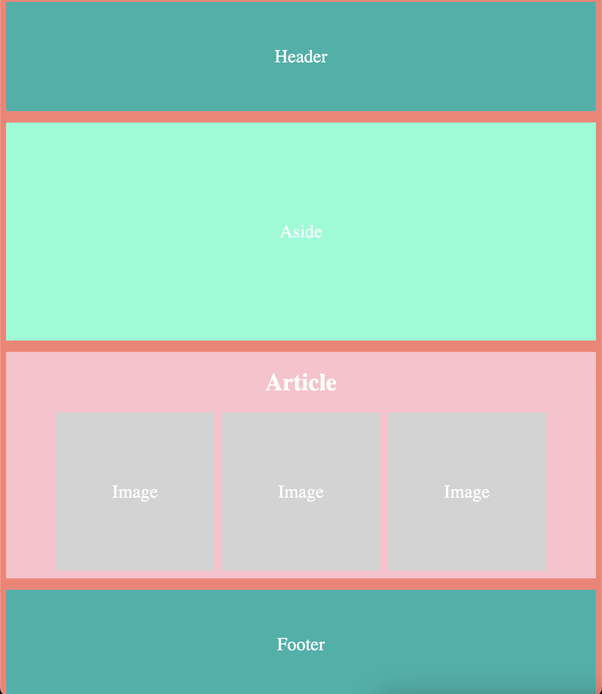

# CSS Activity 14 - Responsive Design with Flexbox, Grid, and Media Queries

## 📋 Instructions

We will take layout shown in the first image below and incorporate a media query to achieve the layout shown in the second image.

## 🖼️ Example

