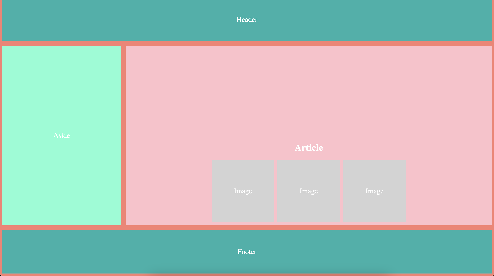

# CSS Activity 15 - Responsive Design with Flexbox & Grid ( Media Queries)

## 📋 Instructions

We will take layout shown in the first image below and incorporate a media query to achieve the layout shown in the second image.

## 🖼️ Example

