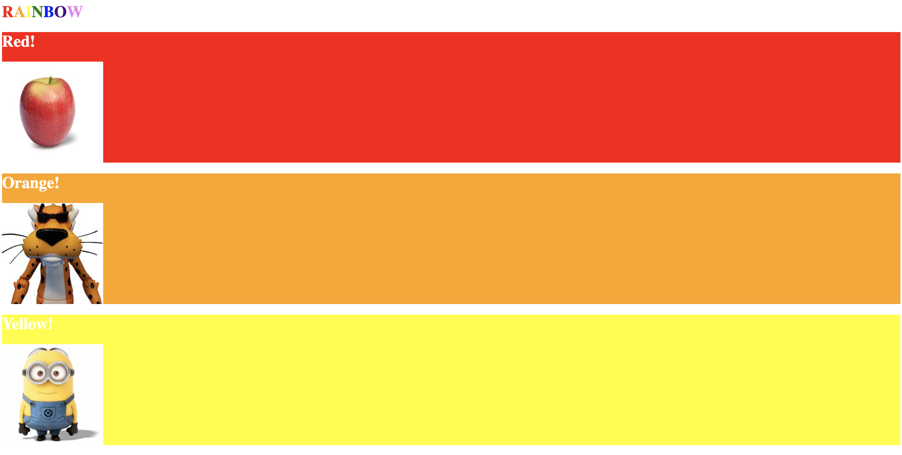
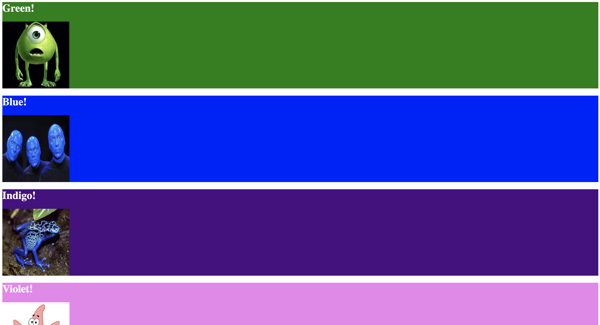

# CSS Activity 2 - Taste the Rainbow

## 📋 Instructions

Create a webpage using styling elements that reflect a rainbow.

Each section's background should reflect the corresponding color, and
there should be an image that also reflects that color. All images should be the same height and width. Create using an internal CSS. 

**Hint:**

```
img {
   height: 200px;
   width:200px;
}
```

## 🖼️ Example




## 💻 Additional Resources

💫 [Intro to CSS (video)](https://www.youtube.com/watch?v=EP9QMdoXvXE)

💫 MDN docs: [CSS Property Index](https://developer.mozilla.org/en-US/docs/Web/CSS/CSS_Properties_Reference)

💫 MDN docs: [How CSS Works](https://developer.mozilla.org/en-US/docs/Learn/CSS/First_steps/How_CSS_works)

💫 W3 Schools: [CSS Introduction](https://www.w3schools.com/css/css_intro.asp)

💫 MDN docs: [Learn to style HTML using CSS](https://developer.mozilla.org/en-US/docs/Learn/CSS)