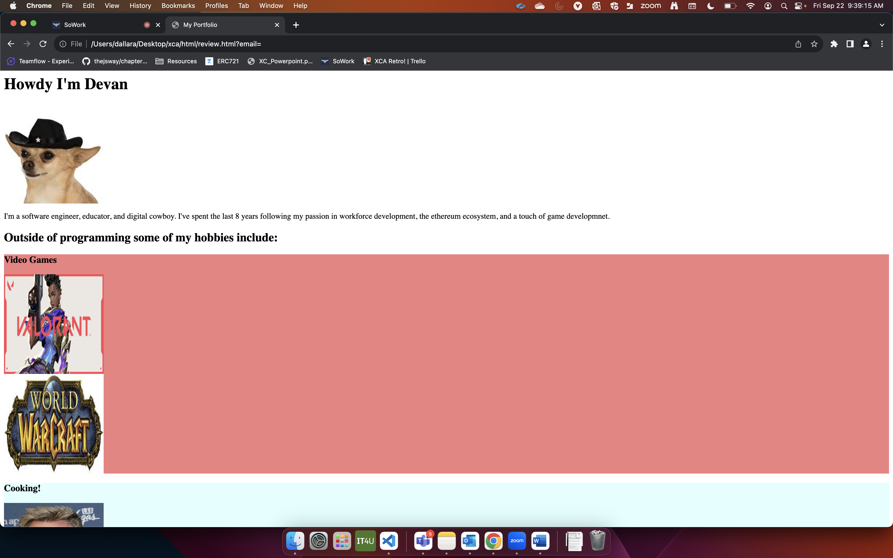
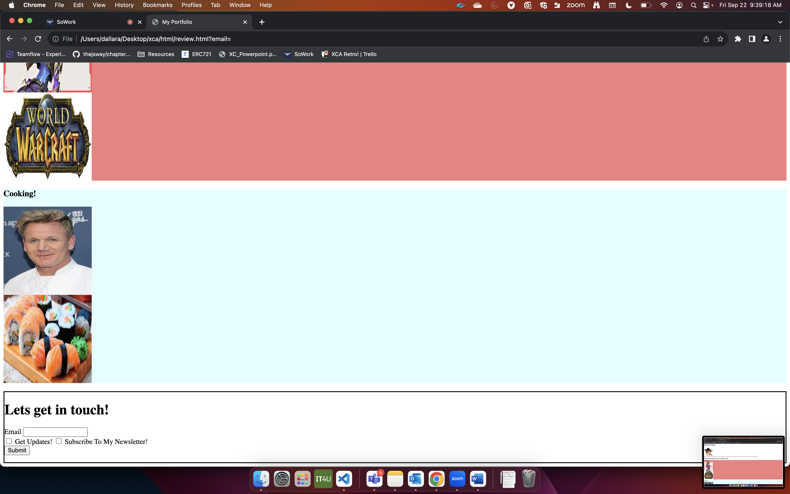

# CSS Activity 3 - About You

## 📋 Instructions

Create a webpage all about you!  

It should include:

- <b><u>About you section:</b></u> Introduce yourself, an image of your choice, and some information about you.
- <b><u>Hobbies section:</b></u> include at least two hobbies sections with images and background color.
- <b><u>Feedback/Contact Form:</b></u> This is a way for people to get in touch with you.

## 🖼️ Example

## 💻 Additional Resources

💫 MDN docs: [CSS Styling Text](https://developer.mozilla.org/en-US/docs/Learn/CSS/Styling_text)

💫 W3 Schools: [CSS Web Fonts](https://www.w3schools.com/css/css3_fonts.asp)
  
💫 MDN docs: [font-face](https://developer.mozilla.org/en-US/docs/Web/CSS/@font-face)