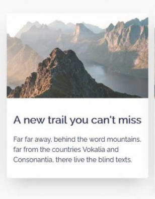

# CSS Activity 4 - Recreate Trail Card

## 📋 Instructions

Your objective is to recreate the card shown below, or make a card very similar to this one.  

It should include:
- an image
- a text area beneath the image for the title and paragraph
- background color 
  
**Hint:** play around with size, and research how to make the card "float" over the background.

## 🖼️ Example

