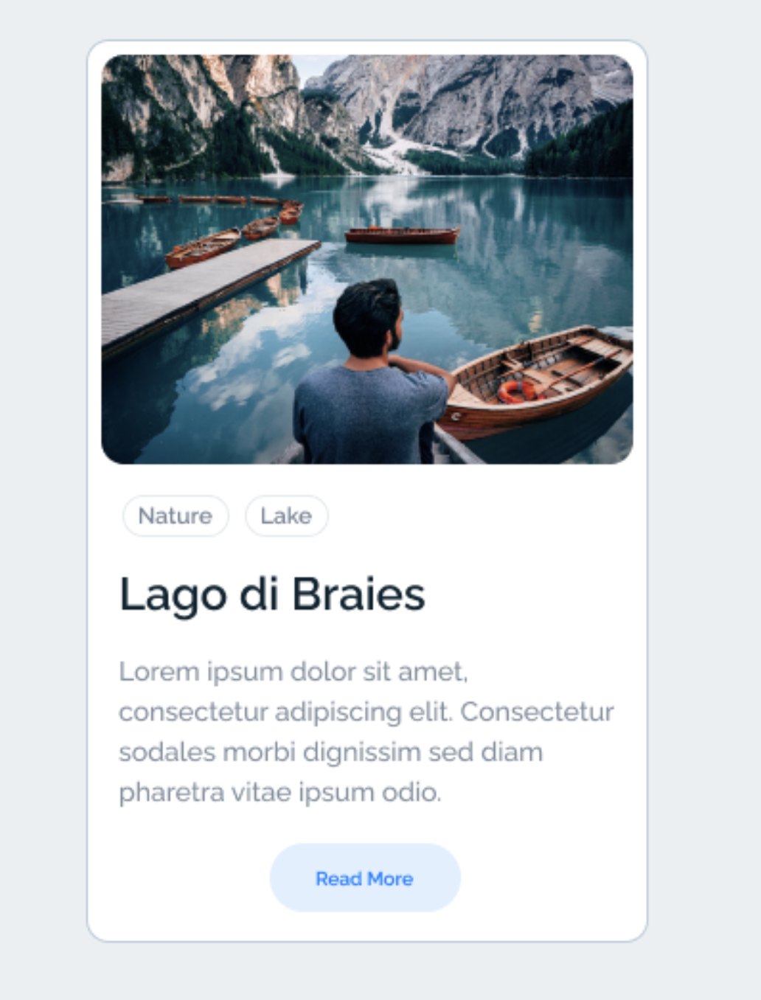

# CSS Activity 5 - Recreate Lake Card

## 📋 Instructions

Your objective is to recreate the card shown below, or make a card very similar to it.  

It should include:

- an image
- a text area beneath the image for the title and paragraph
- background color 
- buttons with and without color

**Hint:** play around with size and radius

## 🖼️ Example

