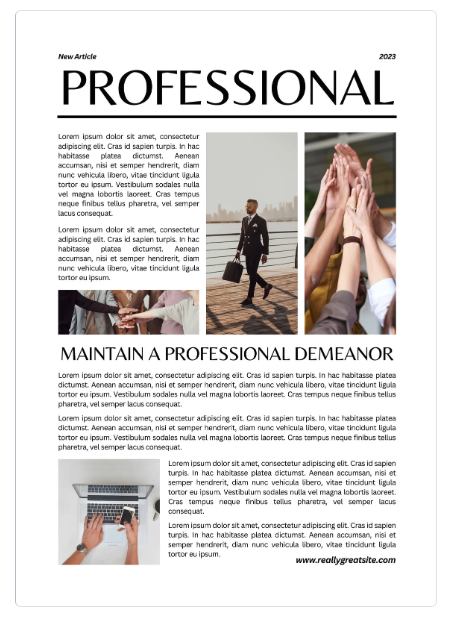

# CSS Activity 7 - Create a Newsletter

## 📋 Instructions

We have learned a lot!  Now is time to show off all of those skills. You are tasked with creating a newsletter. Your newsletter layout must be similar to the image provided below.  

Think about your layout in terms of sections:
- Which areas seem to go together?  
- How can you divide some of the bigger sections into smaller sections?

## 🖼️ Example

