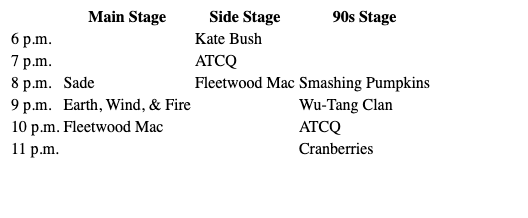

# Classroom Activity 4 - Tables

## 📋 Instructions

In VSCode, create a table to organize the following information.  Make sure to include all of the normal elements needed to create a webpage. 

- Fleetwood Mac will play on the Side Stage at 8pm and the Main Stage at 10pm
- The Smashing Pumpkins will play on the 90s Stage at 8pm
- Sade will play on the Main Stage at 8pm
- Kate Bush will play on the Side Stage at 6pm
- A Tribe Called Quest will play on the 90s Stage at 10pm and Side Stage at 7pm
- Earth, Wind, & Fire will play on the Main Stage at 9pm
- The Cranberries will play on the 90s Stage at 11pm
- Wu Tang Clan will play on the 90s Stage at 9pm

## 🖼️ Example

