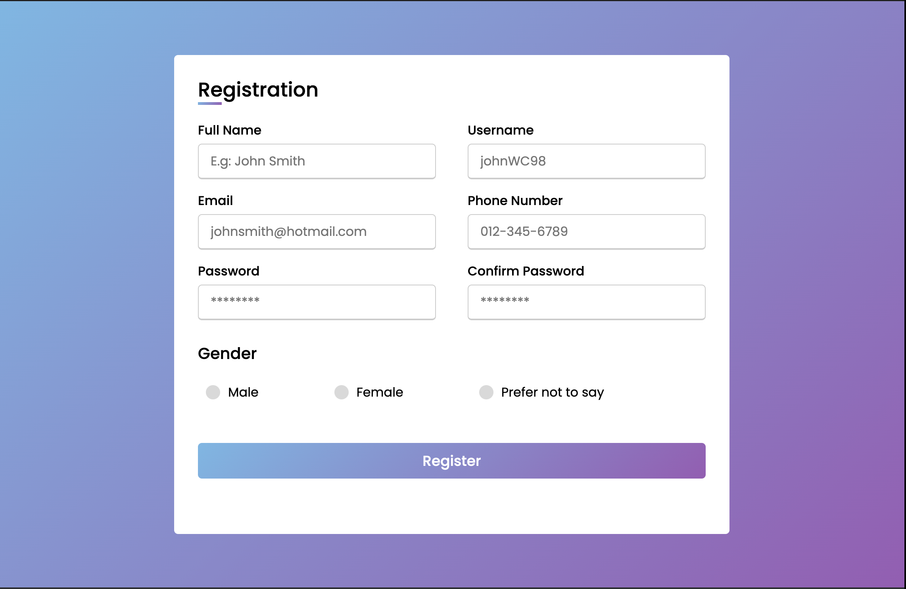

# HTML Activity 8 - Registration Form

## 📋 Instructions

We are going to create a Registration page where users are able to input the following information:

- Full name
- Username
- Email
- Phone Number
- Password an confirm password
- Gender selection
  
Your registration page should include a background. An example has been provided below.

## 🖼️ Example

