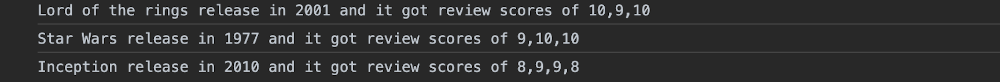

# JS Activity 19 - Web Requests

## 📋 Instructions

Using the following links, fetch the files and console log the different properties in each object.

https://raw.githubusercontent.com/Devan-A/JsonExamples/main/cars.json

https://raw.githubusercontent.com/Devan-A/JsonExamples/main/movies.json

See if you can console log this info so that it looks similar to the image below

