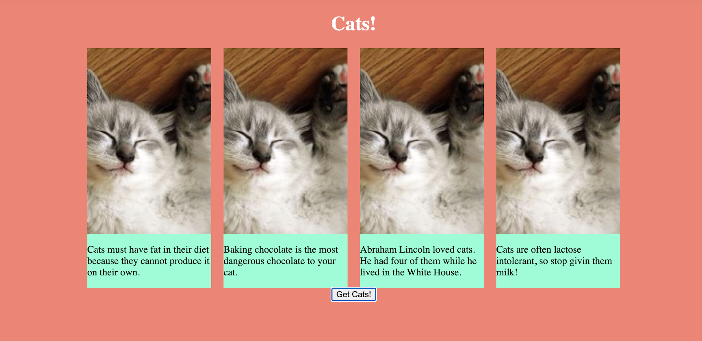

# JS Activity 21 - JSON/Web Request Cat Facts

## 📋 Instructions

Create a webpage that adds cat fact cards!  The idea is fairly simple just have a webpage with a button and when ever you click the button it generates a new card with a cat image and a random cat fact.  Image below for reference. 

https://meowfacts.herokuapp.com/ - Link to the Api to get cat facts

https://placekitten.com/ - link to how to get the cat image (you can also just use what ever image of a cat you want)

